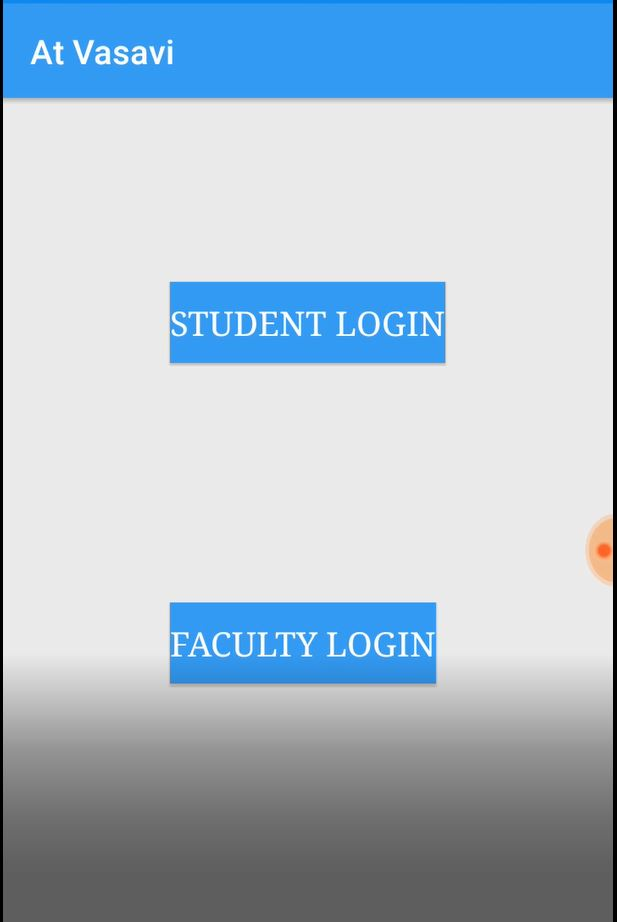

# At Vasavi

AtVasavi is an unofficial learning manageent sytem, developed to ease the communication between students and faculty.
It had two faces,
1. An android application - Intended to serve students to check their syllabus , assignments, recieve short message from faculty and acces college website easily.   
Status - Unpublished from Google Playstore 
2. A website, wher faculty can login with their credintials and able to publish their assignments and messages.

| || |
|-|-|-|
| | |
| | |
